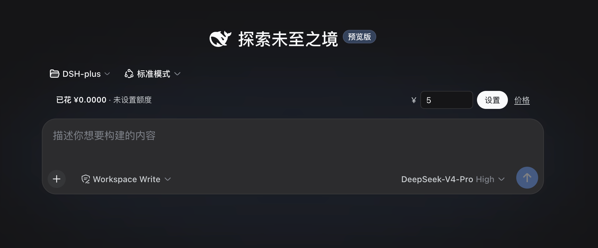
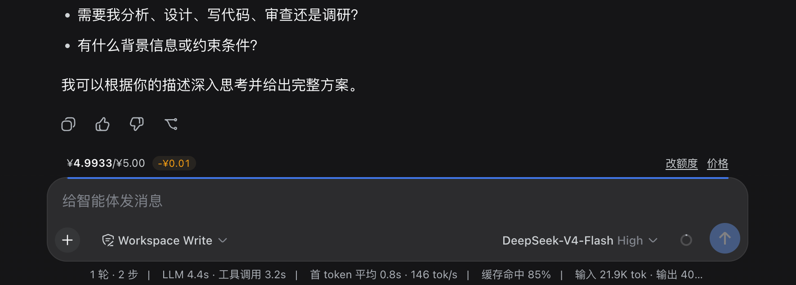
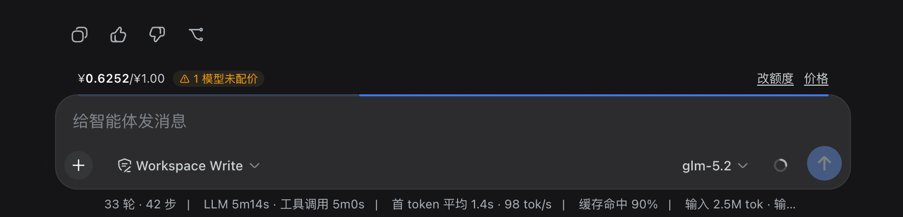
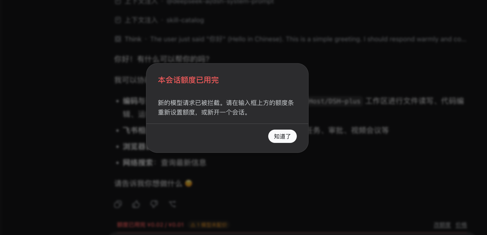

# Quota Meter · 会话额度监控

> **Per-session spend & quota meter for [DSH](https://github.com/deepseek-harness) — real token billing, live progress bar, budget blocking, configurable multi-model pricing.**
>
> 给 DSH 的每个会话窗口设置金额额度：按真实 token 用量 × 可配置价目表记账，输入框上方显示消耗进度条，额度耗尽时自动拦截新的模型调用。

## Screenshots / 效果

| 设置额度 | 消耗反馈 |
|---|---|
|  |  |

| 未配价模型提示 | 限额弹窗 |
|---|---|
|  |  |

| 余额校准胶囊（v0.3.0） | |
|---|---|
|  | 屏幕右上角常驻悬浮：账户余额（官方真实值）+ 实测消耗 + 本会话 已花/剩余，可手动 `↻` 刷新 |

## ✨ Features / 特性

- **Real-token billing** — 按 dsh `llm/stream` 的真实 usage 记账，缓存命中/未命中/输出分档计费
- **Live progress bar** — 输入框上方 2px 细条实时显示剩余额度（右对齐倒退），请求发起时左侧"燃烧"亮点脉动，扣费瞬间弹出 `-¥` 金额徽标
- **Budget blocking** — 额度耗尽自动拦截新的模型调用（`agent/pre-step`），并弹出提示
- **Configurable pricing** — 价目表 UI 可编辑、按模型持久化；支持峰谷（time-of-day）定价，每个模型可自定义时区与高峰时段
- **Weekend off-peak** — 官方新规（2026-08-23 起）周六/周日全天按空闲价计费，自动识别并切换档位
- **Per-session scope** — 记账按会话独立；**子代理消耗自动并入父会话额度**（沿代理链上溯到根父），额度条显示真实总花费；辅助调用（标题生成/上下文压缩）同样计费
- **Persistent ledger** — 额度与已花金额跟随会话持久化（`~/.dsh/storages/quota-meter/sessions/`），重启 dsh 不丢；会话关闭时自动清理，与对话记录生命周期一致

## 📦 Install / 安装

Any machine with dsh CLI — 任意装有 dsh 的机器，一条命令：

```bash
dsh plugin --profile web add github:Lstalu/dsh-quota-meter-plus
```

Locked version — 锁版本安装（推荐正式环境）：

```bash
dsh plugin --profile web add github:Lstalu/dsh-quota-meter-plus#v0.4.1
```

- **Client**（进度条/弹层 UI）→ 刷新浏览器即生效
- **Host**（记账/拦截/接口）→ 重启 dsh web 进程生效
- **Uninstall / 卸载**：`dsh plugin --profile web remove quota-meter`

> Local development — 本地开发用 checkout 链接（改动即时反映）：
> `dsh plugin --profile web add /path/to/quota-meter-plugin`

> **升级注意（已有安装者）**：默认价目表随版本更新，但本机 `prices.json`（如已存在）会覆盖默认值。
> 升级到含新价格的版本后，需在价格弹层点「重置」或删除 `~/.dsh/storages/quota-meter/prices.json`
> 才会用到最新默认价（含新模型 `deepseek-v4-flash-vision-exp`）。

## 💰 Pricing / 计价

价目表动态可编辑（UI 入口：额度条行尾「价格」），持久化到 `~/.dsh/storages/quota-meter/prices.json`。
单位 ¥/每 1M tokens。计价基准：**官方 2026-08-21 页面为美元价**，此处按当日
人民币兑美元中间价 **6.78** 折算（off-peak = 美元价 × 6.78 取 2 位，peak = off-peak × 2）。
汇率与价格均可在 UI 修改。

> ✅ **官方核对（2026-08-21）**：价格点与
> [api-docs.deepseek.com/quick_start/pricing](https://api-docs.deepseek.com/zh-cn/quick_start/pricing)
> 一致（flash/vision 未命中 $0.22、输出 $0.66、命中 $0.007；pro 约 3×）。
> 高峰时段为 UTC 01:00–04:00、06:00–10:00 = 北京 09:00–12:00、14:00–18:00，
> 空闲 = 高峰半价；**新规（2026-08-23 起）周六、周日全天按空闲价计费**。
> 官方 usage 仅报告 `prompt_cache_hit_tokens` / `prompt_cache_miss_tokens`，
> 无独立的缓存写入计费字段（硬盘缓存构建成本并入未命中价），
> 故 `cacheWriteTokens` 对 DeepSeek 恒为 0，`inputWrite` 档仅影响其他厂商。

### deepseek-v4-flash · deepseek-v4-flash-vision-exp

| | 缓存命中 | 缓存未命中 | 输出 |
|---|---|---|---|
| 空闲时段（含周末） | ¥0.05 | ¥1.49 | ¥4.47 |
| 高峰时段 | ¥0.10 | ¥2.98 | ¥8.94 |

### deepseek-v4-pro

| | 缓存命中 | 缓存未命中 | 输出 |
|---|---|---|---|
| 空闲时段（含周末） | ¥0.15 | ¥4.47 | ¥13.42 |
| 高峰时段 | ¥0.30 | ¥8.94 | ¥26.84 |

- **Weekend off-peak / 周末全天空闲**：周六、周日（北京时间）全天按空闲价计费（官方 2026-08-23 起执行）
- **Peak hours / 高峰时段**：北京时间 9:00–12:00、14:00–18:00（每个峰谷模型可自定义时区与区间）
- 未知模型回退到 `fallback` 模型价
- 计价模型：`计费输入 = 未缓存输入 + 缓存命中输入`，输出单独计价

## 🧠 How it works / 工作原理

```
模型调用结束 → llm/stream 流中 {type:'usage'} 块
  → Host 按模型查价目表（峰谷自动选档）折算金额
  → 累加到会话记账本（spent / calls）
  → 客户端 1s 轮询 /quota/state → 进度条前进 + 扣费徽标弹出
额度耗尽 → agent/pre-step 返回 reject → 拦截新调用 + 提示弹窗
```

## 🛠 Develop / 开发

```bash
git clone git@github.com:Lstalu/dsh-quota-meter-plus.git
dsh plugin --profile web add ./dsh-quota-meter-plus   # 本地链接安装
```

改 `index.js`（host）/ `lib/client.js`（client）→ client 刷新即生效，host 重启生效。

## 🔧 增强补丁（相对上游 d9941af）

本仓库为增强维护版，基于官方 d9941af 基线，在官方基础上打了四处补丁（均可提交上游）：

1. **同源防护（安全）**：`/quota/*` 是本地写接口（改额度 / 改价目表），
   浏览器里任意外部网页都能向 `127.0.0.1` 发跨源请求。host 端新增
   `isSameOrigin` 校验——带 `Origin` 的请求要求其 host 与请求 `Host` 头
   完全一致，跨源一律 403；无 Origin 的客户端（curl、本机进程）放行。
2. **`inputWrite` 计费档（口径修正）**：`cacheWriteTokens` 不再并入
   "缓存命中"低价档，改用独立的 `inputWrite` 单价（缺省 = 未命中价，
   保守不低估；Anthropic 等写缓存按 1.25× 输入价计的厂商可自行调高）。
   三档价格组扩展为四档 `{ inputMiss, inputHit, output, inputWrite }`，
   旧价目表自动归一化（缺省 = inputMiss），价格弹层编辑不丢该字段。
   DeepSeek 适配器不报告 `cacheWriteTokens`，该档对 DeepSeek 恒为 0，
   默认配置下记账与官方口径一致。
3. **屏幕右上角常驻悬浮胶囊 + 账户余额校准（v0.3.0）**：
   - 胶囊固定于屏幕右上角（`shell.overlay`，z-index 900），常驻显示
     「账户余额（官方真实值）+ 实测消耗」与「本会话 已花/剩余」两行；
     会话额度 10s 轮询，账户余额 60s 轮询，可手动 `↻` 立即刷新。
   - 余额来自官方接口 `GET https://api.deepseek.com/user/balance`
     （platform.deepseek.com/usage 网站余额的同一数据源，文档化、稳定，
     无需登录态 cookie 爬网页）。host 端 60s 缓存 + 10s 超时 + 首次
     拉取自动记录基线；`实测消耗 = 基线 − 当前余额`（账户级口径），
     供与插件会话记账对照校准。
   - API Key 经胶囊 `⚙` 弹层保存，落盘
     `~/.dsh/storages/quota-meter/config.json`（0600，仅本机），
     或设环境变量 `DSH_DEEPSEEK_API_KEY` / `DEEPSEEK_API_KEY`；
     密钥只发往 api.deepseek.com，接口绝不回显。`重设基线` 按钮可在
     充值后重新锚定参考点。

4. **留空保存 Key 不再清除（v0.4.1，防误清空）**：`/quota/config` 收到
   空的 `apiKey` 时视为"保留现有 Key"，不再覆盖、不再清除——避免在胶囊
   `⚙` 弹层误点「保存」把密钥清掉。只有填入非空 Key 才会更新。

## 📄 License / 许可

MIT
